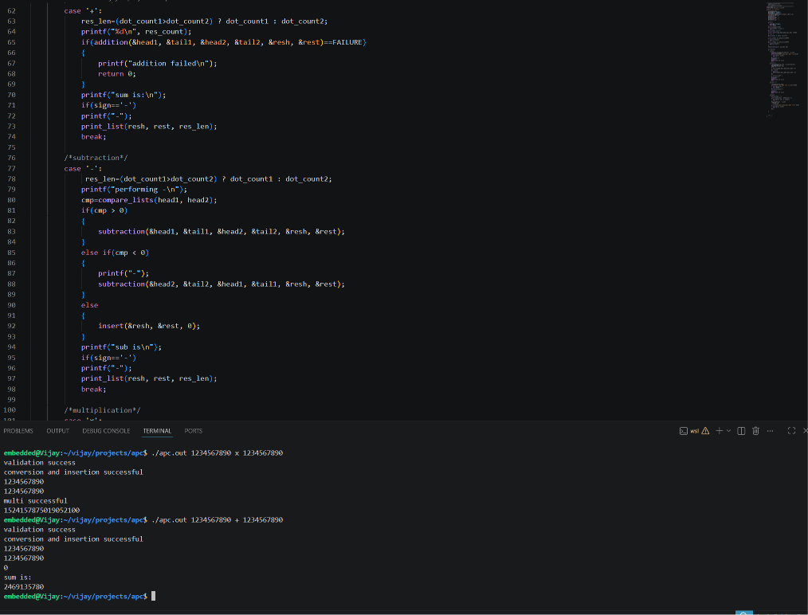
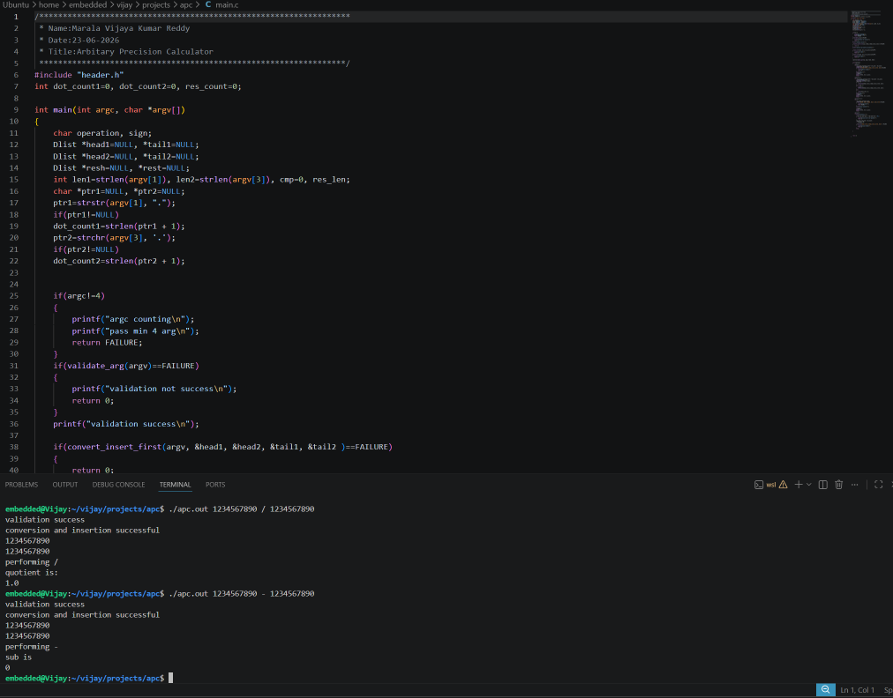
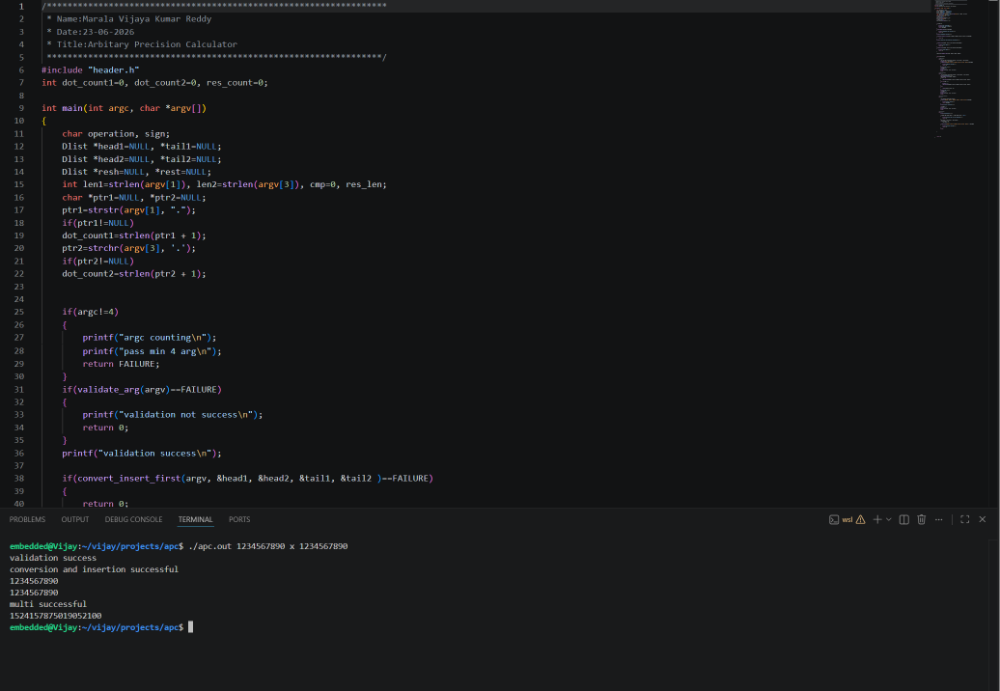
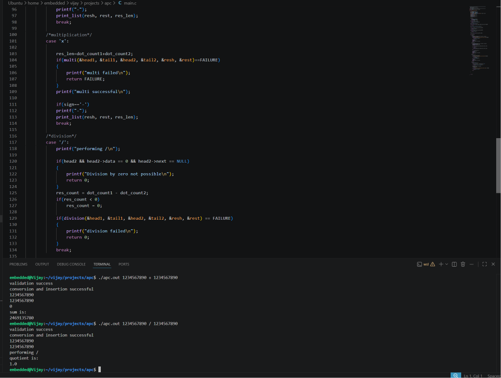

# 🚀 Arbitrary Precision Calculator (APC)

A command-line **Arbitrary Precision Calculator** implemented in **C** using **Doubly Linked Lists** to perform arithmetic operations on numbers of virtually unlimited size. The project overcomes the limitations of built-in C integer data types by representing each digit as a node in a doubly linked list.

---

## 📌 Overview

Traditional C data types (`int`, `long`, `long long`) have fixed storage limits and cannot handle extremely large numbers. This project implements **Big Integer Arithmetic** from scratch using **Dynamic Memory Allocation** and **Doubly Linked Lists**, enabling arithmetic operations on numbers containing hundreds or even thousands of digits.

The calculator supports:

- ➕ Addition
- ➖ Subtraction
- ✖️ Multiplication
- ➗ Division
- Decimal Numbers
- Signed Numbers (+/-)
- Large Integer Calculations

---

## ✨ Features

- Supports arbitrarily large integers
- Decimal number support
- Positive and negative operands
- Command-line interface
- Dynamic memory allocation
- Efficient Doubly Linked List implementation
- Carry and Borrow handling
- Input validation
- Modular code architecture
- Error handling for invalid inputs

---

## 🛠 Technologies Used

- C Programming
- Data Structures
- Doubly Linked Lists
- Dynamic Memory Allocation
- GCC Compiler
- Makefile
- Linux Terminal

---

## 📂 Project Structure

```
Arbitrary-Precision-Calculator
│
├── main.c
├── header.h
├── operation.c
├── compare_list.c
├── print_list.c
├── makefile
├── README.md
└── screenshots
    ├── Addition.png
    ├── Subtraction.png
    ├── Multiplication.png
    └── Division.png
```

---

## ⚙️ Working Principle

Each digit of the input number is stored in a separate node of a **Doubly Linked List**.

Example:

```
123456789
```

Stored as

```
NULL <- [1] <-> [2] <-> [3] <-> [4] <-> [5] <-> [6] <-> [7] <-> [8] <-> [9] -> NULL
```

Arithmetic operations are performed digit-by-digit, similar to manual calculations.

---

## 📋 Supported Operations

| Operation | Supported |
|-----------|-----------|
| Addition | ✅ |
| Subtraction | ✅ |
| Multiplication | ✅ |
| Division | ✅ |
| Large Numbers | ✅ |
| Decimal Numbers | ✅ |
| Signed Numbers | ✅ |

---

# 📸 Output Screenshots

## ➕ Addition



---

## ➖ Subtraction



---

## ✖️ Multiplication



---

## ➗ Division



---

## 💻 Compilation

Compile using Makefile

```bash
make
```

or

```bash
gcc *.c -o apc
```

---

## ▶️ Execution

Addition

```bash
./apc.out 1234567890 + 1234567890
```

Subtraction

```bash
./apc.out 1234567890 - 1234567890
```

Multiplication

```bash
./apc.out 1234567890 x 1234567890
```

Division

```bash
./apc.out 1234567890 / 1234567890
```

---

## 🧠 Algorithms Used

### Addition

- Digit-by-digit addition
- Carry propagation
- Decimal alignment

### Subtraction

- Number comparison
- Borrow propagation
- Sign handling

### Multiplication

Implements Long Multiplication.

- Multiply one digit at a time
- Store intermediate results
- Add partial products
- Generate final result

### Division

Implements repeated subtraction/comparison using linked lists to obtain quotient.

---

## 📚 Concepts Demonstrated

- Data Structures
- Doubly Linked List
- Dynamic Memory Allocation
- Pointer Manipulation
- Command Line Arguments
- String Processing
- Big Integer Arithmetic
- Modular Programming
- Error Handling
- Memory Management

---

## 🚧 Future Enhancements

- Modulus (%)
- Exponentiation
- Square Root
- Scientific Notation
- Expression Evaluation
- Parentheses Support
- Faster Division Algorithm
- Unit Testing
- Performance Optimization

---

## 🎯 Learning Outcomes

This project strengthened my understanding of

- C Programming
- Data Structures
- Dynamic Memory Management
- Linked List Implementation
- Pointer Manipulation
- Large Number Arithmetic
- Algorithm Design
- Debugging Complex Programs
- Modular Software Development

---

## 👨‍💻 Author

**Vijaya Kumar Reddy Marala**

Embedded Systems Enthusiast | C Programmer | Data Structures | Embedded C
